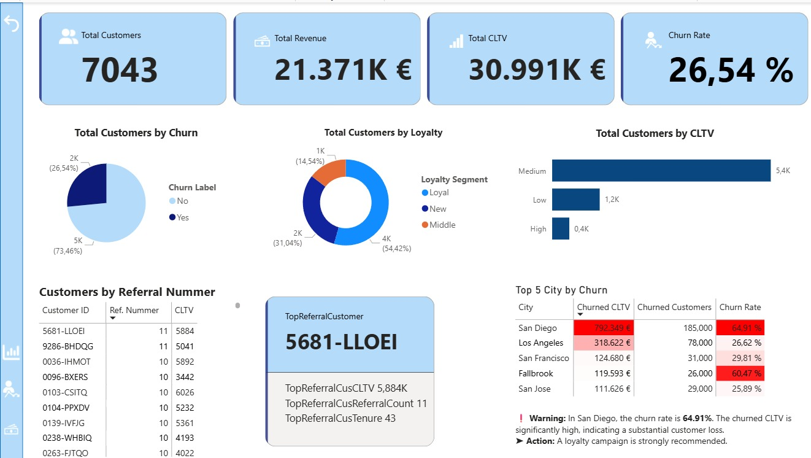
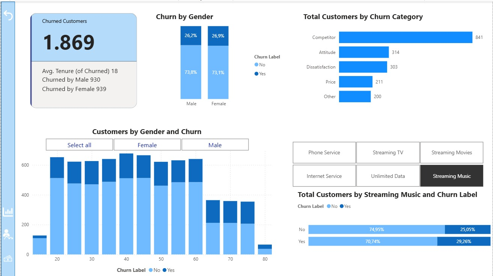
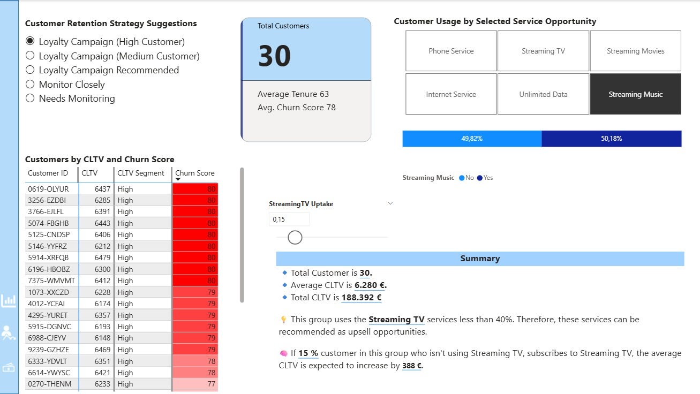
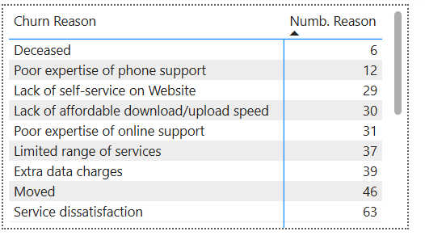

# CRM Analyse Dashboard – Power BI

Dieses Power BI-Projekt analysiert Kundenabwanderung (Churn) anhand von CRM-Daten und liefert wertvolle Einblicke in Overview, Churn-Rate und CLTV-Segmente.

## 🔧 Datenaufbereitung & Datenquelle

- Ursprünglicher Rohdatensatz wurde in Python verarbeitet und in **6 strukturierte Teilmengen** aufgeteilt.
- Diese Datensätze wurden in eine **Azure SQL-Datenbank** geladen.
- Power BI wurde direkt mit Azure SQL verbunden, um die Analyse durchzuführen.
  
## 💡 Highlights

- Interaktives Dashboard mit KPI-Karten
- What-if-Analyse (z. B. Streaming TV Uptake)
- Narrativ (AI Insights)
- Benutzerdefinierte Tooltips und Bookmarks
- Datenmodellierung im Sternschema

## 🛠 Verwendete Technologien

- Python(Pandas, sqlalchemy), Azure Sql Databanken
- Power BI (DAX, Power Query, M-Code)
  
## 🔍 Hauptfunktionen:
- **Gesamtzahl der Kunden:** 7.043  
- **Churn-Rate:** 26,54 %  
- **Gesamter CLTV:** 30.991 K €  
- **Segmentierung** nach Loyalität, Churn-Kategorie und Nutzung von Streaming-Diensten  
- **Top 5 Städte mit höchster Churn-Rate** und konkrete Handlungsempfehlungen  
- **Was-wäre-wenn-Analyse** zur Wirkung von Streaming-TV auf den durchschnittlichen CLTV

## 📊 Dashboard-Seiten:
1. **Übersicht** – KPIs & Segmentierung nach Loyalität und Churn
2. **Churn-Analyse** – Geschlechterverteilung und Abwanderungsgründe
3. **CLTV-Strategie** – Handlungsempfehlungen & Szenarioanalyse
4. **Churn-Analyse Tooltip** – Tooltip zur Anzeige der Gründe für die Kundenabwanderung

## 🧾 Enthaltene Dateien:
- `Report.pbix` – Power BI Projektdatei
-  `connection.py` – Der code ist für Verbindung Azure SQL
-  `daten_aufteilen.py` – Der code ist Data zum Aufteilen
- `telco.csv` – Verwendeter Datensatz  
- `dashboard_screenshots/` – Screenshots der vier Berichtseiten  

## 📷 Screenshots

### 🌐 Übersicht (KPI & Trends)

### 📉 Churnanalyse

### 💰 CLTV Analyse

### 💡 Churn Grunde Tooltip

## 📌 Hinweis:
Dieses Dashboard eignet sich zur Entwicklung gezielter Kundenbindungsstrategien und zur datenbasierten Entscheidungsunterstützung im Bereich Kundenmanagement.

